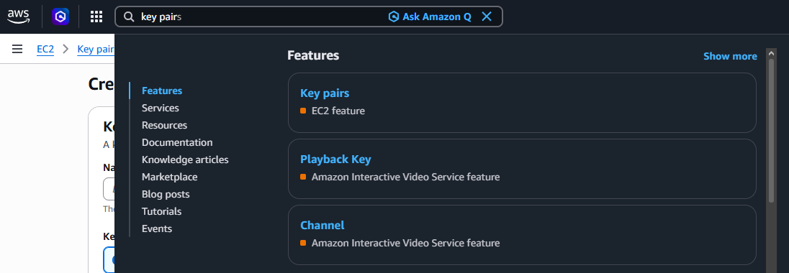
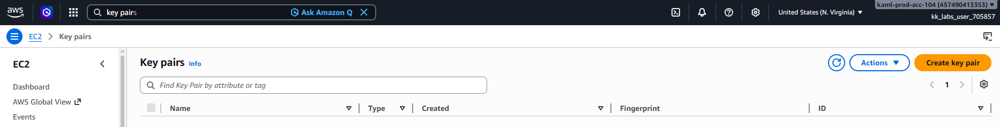
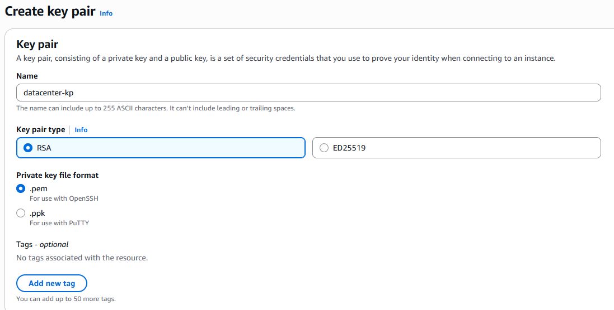

# Day 1: Create Key Pair

## Objective(s)

Create a new EC2 key pair using the parameters given in the lab instructions.

## Skills Learned

- Navigating the AWS Console via its resource search bar
- EC2 key pair creation and the public/private key model for instance access

## Steps Performed

1. Searched for "Key pairs" from the AWS Console search bar, which pointed at the EC2 Key Pairs resource.

   

2. Selected **Create key pair** from the top-right corner.

   

3. Set the key pair name, type, and format as specified in the lab instructions and created it.

   

## Challenges Encountered

No significant challenges faced. The task was completed correctly on the first attempt.

## Lessons Learned

EC2 key pairs are created once and the private key file can only be downloaded at creation time, AWS doesn't retain a copy afterward, so it has to be saved securely right away.

## Reference(s)

- [Amazon EC2 key pairs — AWS documentation](https://docs.aws.amazon.com/AWSEC2/latest/UserGuide/ec2-key-pairs.html)
