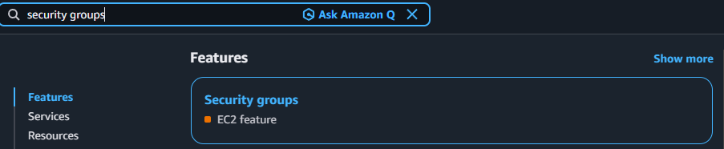
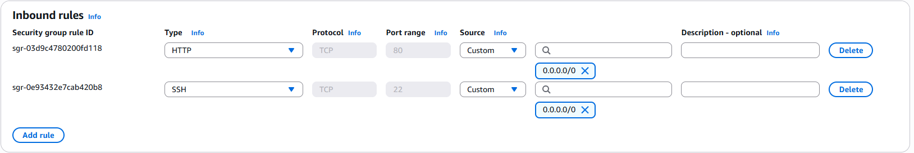
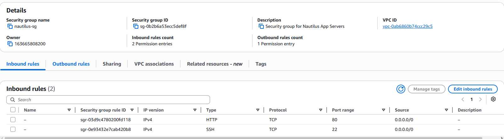

# Day 2: Create Security Group

## Objective(s)

Log into the AWS Console with the provided credentials and create a security group per the lab requirements.

## Skills Learned

- Creating and configuring EC2 security groups
- Defining inbound rules by type, protocol, port range, and source
- Understanding stateful vs. stateless firewall behavior

## Steps Performed

1. Logged into the AWS Console with the credentials provided for the lab, then navigated to the Security Groups section of EC2.

   

2. Created the security group (`nautilus-sg`) using the details given in the lab instructions.

   

3. Confirmed the inbound rules: HTTP (port 80) and SSH (port 22), both open to `0.0.0.0/0`.

   

## Challenges Encountered

No significant challenges faced. The task was completed correctly on the first attempt.

## Lessons Learned

A security group is stateful, an inbound rule allowing traffic on a port automatically allows the matching outbound return traffic, so you generally don't need a mirrored outbound rule for a simple request/response service.

## Reference(s)

- [Security groups for your VPC — AWS documentation](https://docs.aws.amazon.com/vpc/latest/userguide/vpc-security-groups.html)
