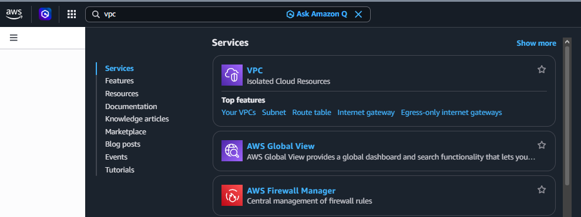
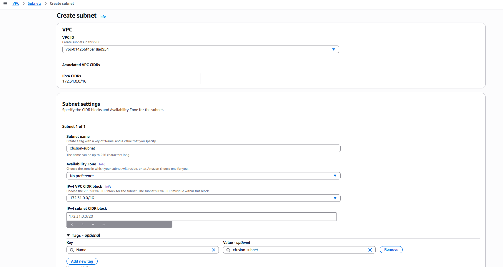
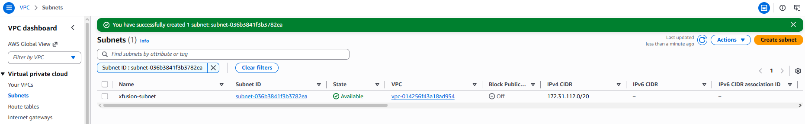

# Day 3: Create Subnet

## Objective(s)

Create a subnet named `xfusion-subnet` under the default VPC in the `us-east-1` region.

## Skills Learned

- VPC and subnet fundamentals
- Reading and validating CIDR blocks against a parent VPC

## Steps Performed

1. Logged into the AWS Console and navigated to the VPC service, since that's where subnets are managed.

   

2. Created the subnet under the default VPC using the name given in the task.

   

3. Confirmed the subnet details, `xfusion-subnet`, CIDR `172.31.112.0/20`, in the default VPC, state `Available`.

   

## Challenges Encountered

No significant challenges faced. The task was completed correctly on the first attempt.

## Lessons Learned

A subnet's CIDR block must fall inside its parent VPC's CIDR range and can't overlap any other subnet already carved out of that VPC.

## Reference(s)

- [VPCs and subnets — AWS documentation](https://docs.aws.amazon.com/vpc/latest/userguide/configure-subnets.html)
