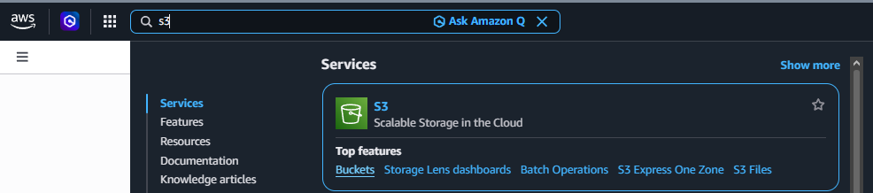
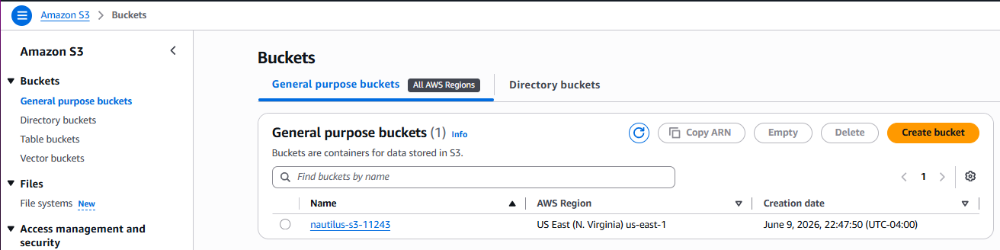
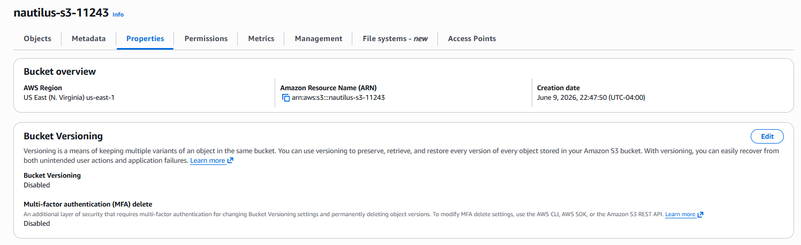
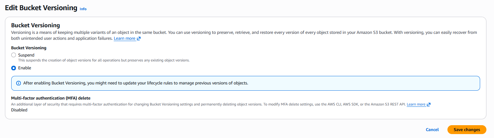

# Day 4: Enable Versioning For S3 Bucket

## Objective(s)

Enable versioning on the specified S3 bucket.

## Skills Learned

- Navigating S3 bucket properties in the AWS Console
- Understanding S3 object versioning and its effect on future writes

## Steps Performed

1. Logged into the AWS Console and navigated to the S3 service.

   

2. Located and opened the target bucket.

   

3. Found the versioning setting under the bucket's **Properties** tab.

   

4. Edited the setting and enabled versioning.

   

## Challenges Encountered

No significant challenges faced. The task was completed correctly on the first attempt.

## Lessons Learned

Once enabled, S3 bucket versioning can be suspended but not fully turned back off. Every object write from then on creates a new version instead of overwriting the previous one, which is what protects against accidental deletes/overwrites.

## Reference(s)

- [Using versioning in S3 buckets — AWS documentation](https://docs.aws.amazon.com/AmazonS3/latest/userguide/Versioning.html)
