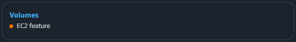
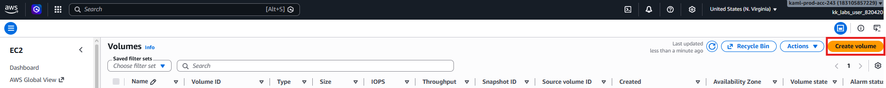
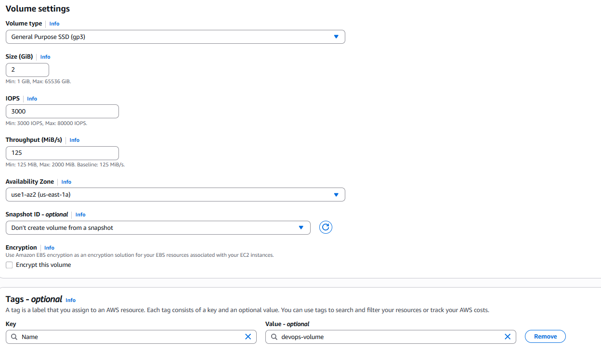

# Day 5: Create GP3 Volume

## Objective(s)

Create an EBS volume with the following requirements:

- Name: `devops-volume`
- Type: `gp3`
- Size: `2GB`
- Region: `us-east-1`

## Skills Learned

- Creating EBS volumes with specific type/size/AZ settings
- Naming AWS resources via tags rather than a dedicated name field

## Steps Performed

1. Logged into the AWS Console and navigated to the Volumes section of EC2.

   

2. Selected **Create volume**.

   

3. Set the volume type to `gp3`, size to `2` GiB, and the availability zone in `us-east-1`. The **Name** field required adding a `Name` tag rather than a direct input, so a tag with key `Name` and value `devops-volume` was added.

   

## Challenges Encountered

The console has no direct "name" input for a volume. It initially wasn't obvious that naming happens through the Tags section instead.

## Lessons Learned

EC2/EBS resources don't have a native "name" attribute. What shows as the Name column in the console is really just a tag with key `Name`, so naming a resource is done through the Tags section, not a dedicated name field.

## Reference(s)

- [Amazon EBS volume types — AWS documentation](https://docs.aws.amazon.com/AWSEC2/latest/UserGuide/ebs-volume-types.html)
