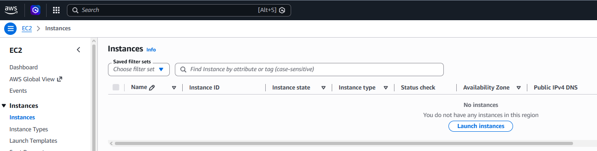

# Day 6: Launch EC2 Instance

## Objective(s)

Create an EC2 instance with the following requirements:

- Name: `nautilus-ec2`
- Amazon Linux AMI
- `t2.micro`
- RSA key pair: `nautilus-kp`
- Default security group

## Skills Learned

- Using the EC2 Launch Instance wizard (AMI, instance type, key pair, security group selection)
- Understanding the difference between an instance being launched and being fully running/passed status checks

## Steps Performed

1. Logged into the AWS Console, navigated to the EC2 service, and selected **Instances** from the left-hand menu.

   

2. Selected **Launch instances** and set the AMI, instance type, key pair, and security group per the requirements above, then launched it.

## Challenges Encountered

The lab was closed before the instance had fully initialized and passed its status checks on the first attempt, which caused the initial validation to fail, the check requires waiting for the instance to reach a fully **running** state, not just for the launch request to succeed.

## Lessons Learned

"Launched" and "running/passed status checks" are different states, a lab validation (or any automated check) that expects a healthy instance needs you to wait out the boot and status-check cycle, not just submit the launch request.

## Reference(s)

- [Launch an instance using the launch instance wizard — AWS documentation](https://docs.aws.amazon.com/AWSEC2/latest/UserGuide/ec2-launch-instance-wizard.html)
