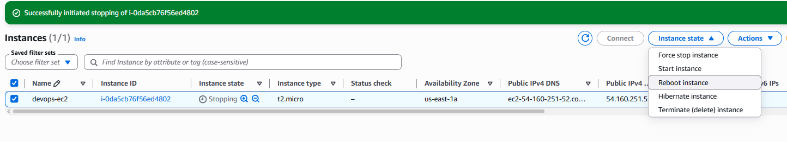
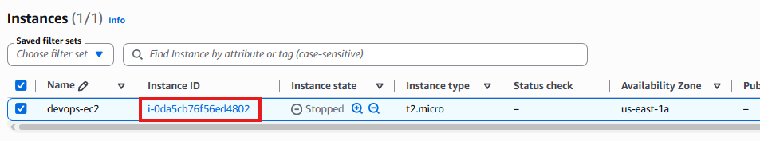
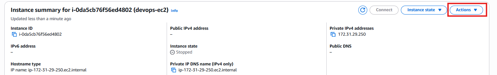
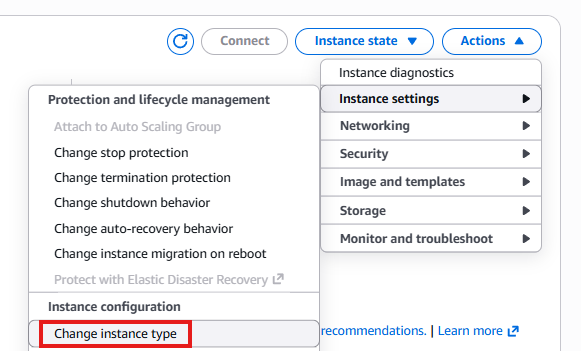
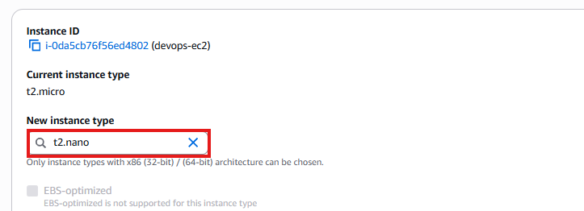
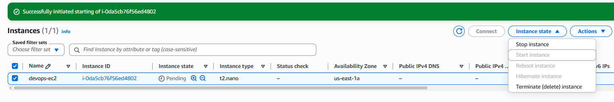

# Day 7: Change EC2 Instance Type

## Objective(s)

Change the `devops-ec2` instance from `t2.micro` to `t2.nano` and make sure it's running again afterward.

## Skills Learned

- Modifying an EC2 instance's type through the console
- Understanding the stop → modify → start lifecycle required for instance type changes

## Steps Performed

1. Located the instance and stopped it. You can't change instance type on a running instance.

   

2. Once fully stopped, selected the instance by its instance ID.

   

3. Opened the **Actions** menu.

   

4. From **Instance settings**, chose **Change instance type**.

   

5. Selected `t2.nano` as the new instance type and saved the change.

   

6. Started the instance back up.

   

7. Waited for the instance to reach the **running** state before considering the task complete.

   

## Challenges Encountered

No significant challenges faced. The requirement to stop the instance before changing its type was identified up front.

## Lessons Learned

An EC2 instance's type can only be changed while it's stopped. The console will let you get partway through the flow on a running instance, but the change itself requires a stop/modify/start cycle.

## Reference(s)

- [Change the instance type — AWS documentation](https://docs.aws.amazon.com/AWSEC2/latest/UserGuide/ec2-instance-resize.html)
