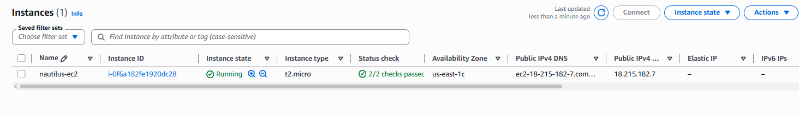
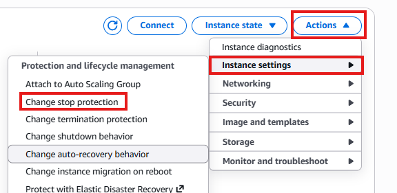
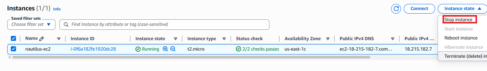
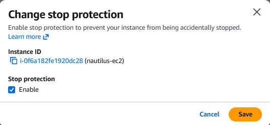
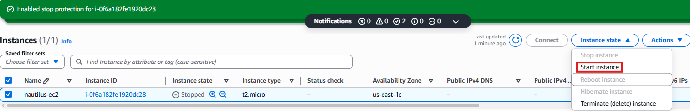

# Day 8: Enable Stop Protection for EC2 Instance

## Objective(s)

Enable stop protection on the `nautilus-ec2` instance.

## Skills Learned

- Configuring EC2 instance protection settings
- Understanding what stop protection blocks vs. what it doesn't

## Steps Performed

1. Logged into the AWS Console and located the instance in the EC2 Instances section.

   

2. Selected the instance, then found **Change stop protection** under **Actions → Instance settings**.

   

3. Stopped the instance first and waited for it to reach a fully stopped state.

   

4. Enabled stop protection, then started the instance back up.

   

5. Waited for the instance to return to the **running** state before validating the lab.

   

## Challenges Encountered

No significant challenges faced. The task was completed correctly on the first attempt.

## Lessons Learned

Stop protection blocks the `StopInstances` API call/console action outright. It has to be explicitly disabled again before the instance can be stopped, which is a useful safeguard against accidentally stopping a production instance.

## Reference(s)

- [Stop and start your instance — AWS documentation](https://docs.aws.amazon.com/AWSEC2/latest/UserGuide/Stop_Start.html)
