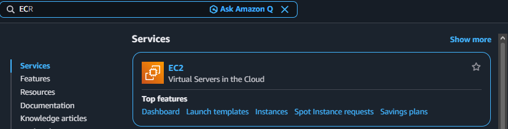
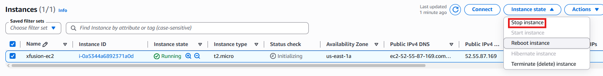
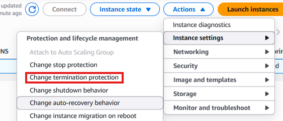
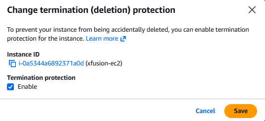
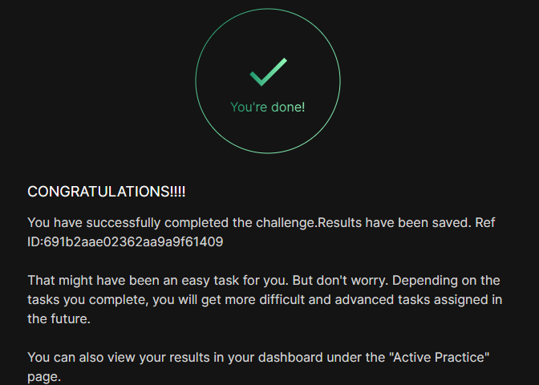

# Day 9: Enable Termination Protection for EC2 Instance

## Objective(s)

There's an instance in the account without termination protection. Enable termination protection for it.

## Skills Learned

- Configuring EC2 termination protection
- Recognizing which instance-protection settings are state-dependent (stop protection, instance type) vs. which aren't (termination protection)

## Steps Performed

1. Logged into the AWS Console and navigated to the EC2 Instances section.

   

2. Stopped the running instance before making any changes.

   

3. Once fully stopped, found **Change termination protection** under **Actions → Instance settings**.

   

4. Enabled termination protection on the instance.

   

5. Started the instance back up and waited for it to reach the **running** state.

   

6. Lab validated as complete.

   

## Challenges Encountered

No significant challenges faced. The instance was stopped out of caution before making the change, though this turned out not to be strictly necessary.

## Lessons Learned

Unlike stop protection, termination protection can be toggled while the instance is running or stopped. This walkthrough stopped it first out of caution, but the setting itself isn't state-dependent the way instance type changes are.

## Reference(s)

- [Enable termination protection for an instance — AWS documentation](https://docs.aws.amazon.com/AWSEC2/latest/UserGuide/terminating-instances.html#Using_ChangingDisableAPITermination)
