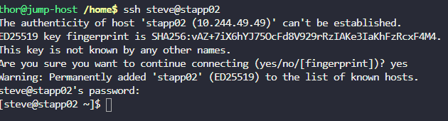
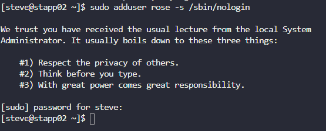

# Day 1: Linux User Setup with Non-Interactive Shell

## Task

Create a new user, `rose`, on the correct application server, ensuring the account has no interactive shell access.

## Steps

1. A webpage listing all servers and their credentials was provided. Checking it showed the credentials for **App Server 2**, under user `steve`.


2. Used those credentials to SSH into App Server 2 (`stapp02`) as `steve`.

   ```bash
   ssh <user>@<ip>
   ```

   

3. Created the `rose` user with `/sbin/nologin` as the shell, so the account exists but cannot be used for interactive logins.

   ```bash
   sudo adduser <user> -s /sbin/nologin
   ```

   

## Key Takeaway

The `-s` flag on `adduser`/`useradd` sets a user's login shell. Pointing it at `/sbin/nologin` blocks interactive shell access while still letting the account exist the standard pattern for service or restricted accounts.
