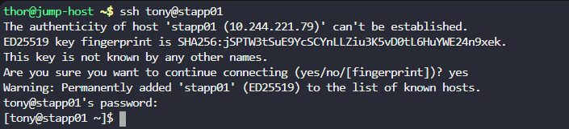
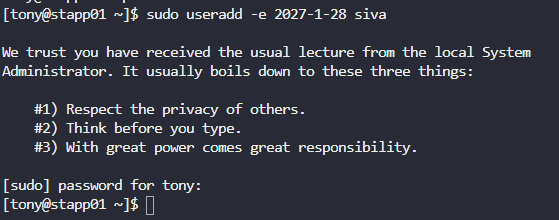

# Day 2: Temporary User Setup With Expiry

## Objective(s)

Create a temporary user account on the correct application server that automatically expires on a given date.

## Skills Learned

- Locating target host/credential info from a shared inventory
- Creating time-limited Linux accounts with `useradd -e`
- Account lifecycle management for temporary/contractor access

## Steps Performed

1. Credentials for **App Server 1** were provided on the servers/credentials page:

2. Logged into the server via SSH.

   ```bash
   ssh <user>@<ip>
   ```

   

3. Created the temporary user with an expiration date using `useradd -e`:

   ```bash
   sudo useradd -e <expiry_date> <user>
   ```

   

## Challenges Encountered

No significant challenges faced. The task was completed correctly on the first attempt.

## Lessons Learned

The `-e` flag on `useradd` sets an account expiration date (`YYYY-MM-DD`). After that date the account is automatically locked, which is useful for contractor or temporary access without needing a manual cleanup step later.

## Reference(s)

- [useradd(8) man page](https://man7.org/linux/man-pages/man8/useradd.8.html)
