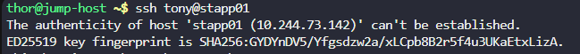
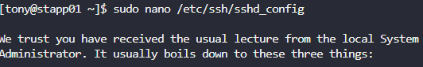
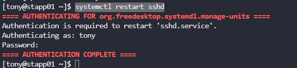
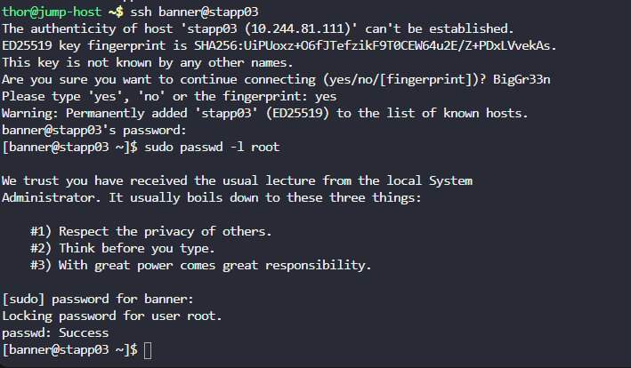

# Day 3: Secure Root SSH Access

## Objective(s)

Disable direct root SSH login on all the application servers.

## Skills Learned

- Editing OpenSSH server configuration (`sshd_config`)
- Applying config changes by restarting the `sshd` service
- Distinguishing between disabling a password (`passwd -l`) and disabling a login method (`PermitRootLogin`)

## Steps Performed

1. Gathered the credentials for all app servers, then logged into App Server 1 via SSH.

   ```bash
   ssh <user>@<ip>
   ```

   

2. Researched the setting and found it lives in `sshd_config`, on the `PermitRootLogin yes` line:

   ```bash
   sudo nano /etc/ssh/sshd_config
   ```

   Changed `PermitRootLogin yes` to `PermitRootLogin no`.

   
   

3. Restarted the SSH service to apply the change, then repeated the process on the remaining app servers.

   ```bash
   sudo systemctl restart sshd
   ```

   

4. First attempt was marked incorrect. Tried locking the root account directly instead:

   ```bash
   sudo passwd -l root
   ```

   

   This also failed the check.

## Challenges Encountered

Both the initial `sshd_config` edit and the `passwd -l root` fallback failed the lab's validation. The root cause was that `PermitRootLogin no` had been left commented out in `sshd_config`, so the original edit never actually took effect, uncommenting the line was the fix that finally worked.

## Lessons Learned

Editing a config value in `sshd_config` has no effect if the line is still commented out. The `#` has to be removed, not just the value changed. `passwd -l` locks the password but doesn't disable key-based root login, so it isn't a substitute for `PermitRootLogin no`.

## Reference(s)

- [sshd_config(5) man page](https://man7.org/linux/man-pages/man5/sshd_config.5.html)
