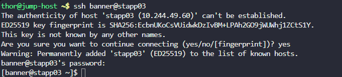
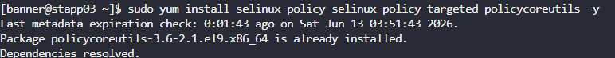

# Day 5: SELinux Installation and Configuration

## Objective(s)

Install the required SELinux packages and permanently disable SELinux on the correct application server.

## Skills Learned

- Identifying a server's underlying distro family (Debian vs. RHEL/CentOS) before picking a package manager
- Installing packages with `yum`
- Permanently changing SELinux mode via its config file

## Steps Performed

1. SSH'd into the target server using the provided credentials.

   ```bash
   ssh <user>@<ip>
   ```

   

2. `apt` wasn't available since the server is CentOS-based rather than Debian-based, so `yum` was used to install the SELinux packages instead:

   ```bash
   sudo yum install selinux-policy selinux-policy-targeted policycoreutils -y
   ```

   

3. Edited the SELinux config file to permanently disable it:

   ```bash
   sudo nano /etc/selinux/config
   ```

   

4. Set `SELINUX=disabled` and saved the file.

   

## Challenges Encountered

The first package manager attempt assumed a Debian-based system (`apt`), which failed because the server is actually CentOS-based. Switching to `yum` resolved it.

## Lessons Learned

SELinux's mode is controlled by `/etc/selinux/config`, not a live command. Disabling it there means the setting only takes full effect after a reboot, unlike a service you can just restart. Confirming the OS family first avoids wasted attempts with the wrong package manager.

## Reference(s)

- [Using SELinux — Red Hat Enterprise Linux 8 documentation](https://access.redhat.com/documentation/en-us/red_hat_enterprise_linux/8/html/using_selinux/index)
