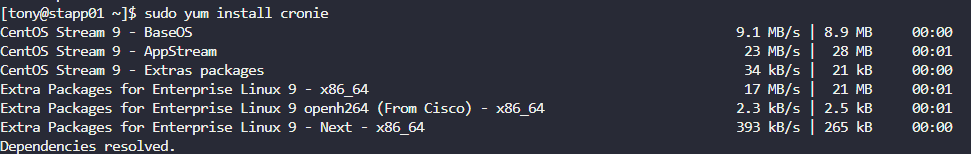
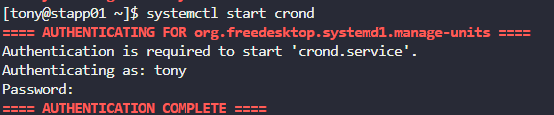
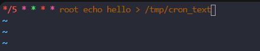
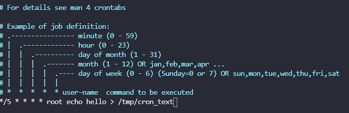

# Day 6: Create a Cron Job

## Objective(s)

Create a cron job on all of the application servers, scheduled to run as a specific user.

## Skills Learned

- Installing and starting cron on a server that doesn't have it (`cronie`, `crond`)
- Editing cron schedules with `crontab -e`
- Understanding the difference between a personal crontab and `/etc/crontab`

## Steps Performed

1. Installed the `cronie` package to get cron support on the server.

   ```bash
   sudo yum install cronie
   ```

   

2. Started the `crond` service.

   ```bash
   systemctl start crond
   ```

   

3. The task required the job to run as a specific user (`<user>`), so a schedule line with a user field was entered into the personal crontab:

   ```bash
   crontab -e
   ```

   ```cron
   */5 * * * * <user> <command>
   ```

   

4. Research showed the entry needs to go in `/etc/crontab` instead, which does support specifying the user to run the job as:

   ```bash
   sudo nano /etc/crontab
   ```

   ```cron
   */5 * * * * <user> <command>
   ```

   

## Challenges Encountered

A personal crontab (edited via `crontab -e`) has no user field, so the schedule line with a user column didn't work there. The job had to be moved to `/etc/crontab`, which does support that format.

## Lessons Learned

`crontab -e` edits the current user's personal crontab, which has no user column. `/etc/crontab` (and files under `/etc/cron.d/`) use a different format with an extra field so the job can be scheduled to run as any user, including `root`.

## Reference(s)

- [crontab(5) man page](https://man7.org/linux/man-pages/man5/crontab.5.html)
