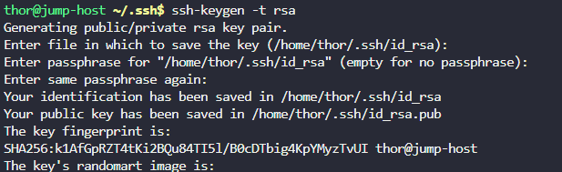
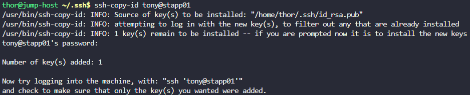

# Day 7: Linux SSH Authentication

## Objective(s)

Set up password-less SSH login from the jump server to every application server user.

## Skills Learned

- Generating SSH key pairs with `ssh-keygen`
- Distributing public keys with `ssh-copy-id`
- Correct `.ssh` directory/file structure and permissions (`700` on `.ssh`, `authorized_keys` as a file)
- Diagnosing SSH auth failures by testing with an explicit identity file (`ssh -i`)

## Steps Performed

1. Logged into each app server to check the state of their `.ssh` directories, using the credentials gathered for each host.

2. Created the missing `.ssh` directory on an app server:

   ```bash
   mkdir .ssh
   ```

   

3. Set the correct permissions on it:

   ```bash
   chmod 700 .ssh
   ```

   

4. Created a directory for authorized keys and set permissions on it:

   ```bash
   mkdir authorized_keys
   chmod 600 authorized_keys/
   ```

   

5. Generated an SSH key pair on the jump server:

   ```bash
   ssh-keygen -t rsa
   ```

   

6. Copied the public key to an app server user:

   ```bash
   ssh-copy-id <user>@<ip>
   ```

   

7. Login still prompted for a password. Tried adjusting the private key's permissions and connecting directly with it, which also didn't resolve it:

   ```bash
   chmod 600 id_rsa
   ssh -i id_rsa <user>@<ip>
   ```

   

8. Removed the `authorized_keys` directory created in step 4:

   ```bash
   rmdir authorized_keys/
   ```

   

9. Re-ran `ssh-copy-id`, which was now able to create `authorized_keys` correctly and install the key:

   ```bash
   ssh-copy-id <user>@<ip>
   ```

   

## Challenges Encountered

`authorized_keys` had been created as a **directory** instead of a file in step 4. SSH expects `authorized_keys` to be a regular file, so key-based login kept falling back to a password prompt even after `ssh-copy-id` appeared to run and after manually setting key permissions. It only started working once the directory was removed and `ssh-copy-id` was allowed to create the file itself.

## Lessons Learned

`authorized_keys` must be a regular file under `~/.ssh/`, not a directory, `ssh-copy-id` and `sshd` will not append keys correctly if a directory occupies that path. When a "working" fix doesn't take effect, check whether an earlier step left the filesystem in an unexpected state before assuming the auth step itself is wrong.

## Reference(s)

- [ssh-copy-id man page](https://man.openbsd.org/ssh-copy-id)
- [OpenSSH — Key-based authentication](https://www.openssh.com/manual.html)
