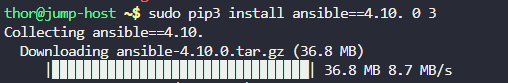

# Day 8: Install Ansible

## Objective(s)

Install Ansible version 4.10.0 using `pip3` and make sure the binary is available globally on the system.

## Skills Learned

- Installing a pinned package version with `pip3`
- Verifying installed Python packages with `pip3 list`
- Understanding how `sudo pip3 install` affects binary availability system-wide

## Steps Performed

1. Installed the pinned Ansible version with `pip3`:

   ```bash
   sudo pip3 install ansible==4.10.0
   ```

   

2. Verified the installed packages:

   ```bash
   pip3 list
   ```

   

3. Checked the users on the server to confirm the environment before validating the lab:

   ```bash
   cat /etc/passwd
   ```

   

## Challenges Encountered

No significant cahllenges faced. the task was completed correctly on the first attempt.

## Lessons Learned

Installing a Python package with `sudo pip3 install` puts it on the system path, which is what makes the resulting binary (`ansible`) globally available rather than scoped to a single user's environment.

## Reference(s)

- [Installing Ansible — official documentation](https://docs.ansible.com/ansible/latest/installation_guide/intro_installation.html)
