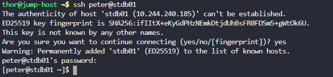
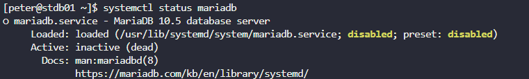
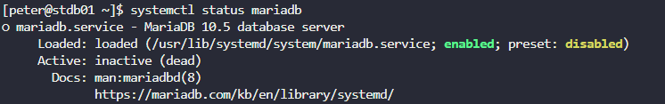
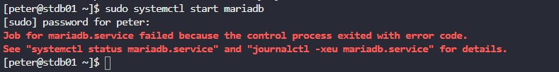
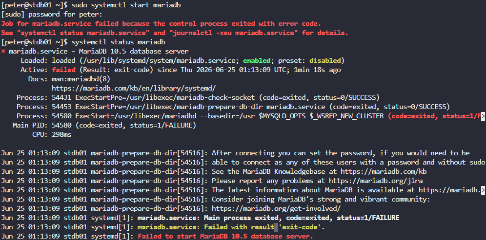
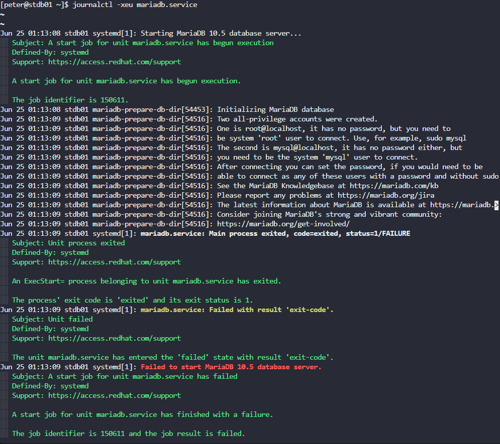
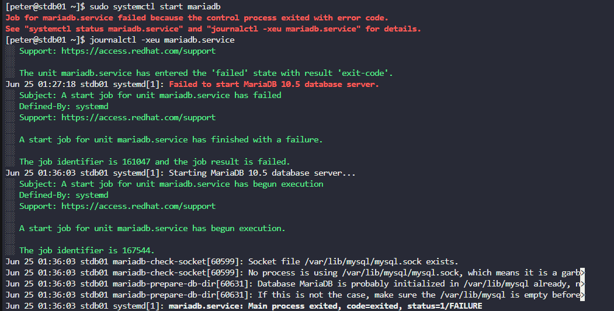
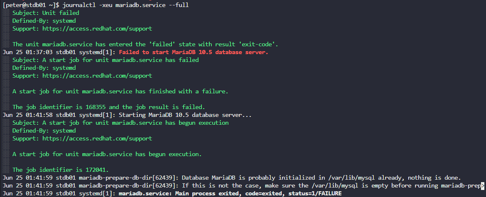
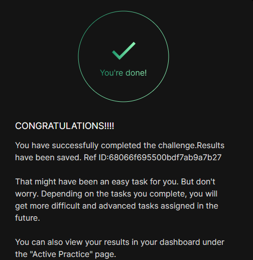

# Day 9: MariaDB Troubleshooting

## Objective(s)

An application in the datacenter is down because the `mariadb` service is down on the database server. Diagnose and fix it.

## Skills Learned

- systemd service troubleshooting (`systemctl status`, `enable`, `start`)
- Reading `journalctl` output to trace a service failure
- Correlating a service's own log file with systemd's journal
- Diagnosing and fixing filesystem ownership/permission issues blocking a daemon

## Steps Performed

1. Logged into the database server via SSH.

   ```bash
   ssh <user>@<ip>
   ```

   

2. Checked the service status and found it disabled and inactive:

   ```bash
   systemctl status mariadb
   ```

   

3. Re-enabled the service:

   ```bash
   sudo systemctl enable mariadb
   ```

   

4. Checked status again showed it was now enabled, but the preset is still disabled and the service is inactive. Editing a unit's preset directly isn't recommended since a future package update can silently revert it ([reference](https://askubuntu.com/questions/1482929/how-to-change-vendor-preset-in-systemd)), so the service was just started instead of touching the preset.

   

5. Starting the service failed:

   ```bash
   sudo systemctl start mariadb
   ```

   

6. Checked the detailed status, which pointed at the process exiting with an error:

   ```bash
   systemctl status mariadb
   ```

   

7. Pulled the service logs for more detail:

   ```bash
   journalctl -xeu mariadb.service
   ```

   

8. Based on further research ([reference](https://askubuntu.com/questions/1539761/maria-db-wont-start)), suspected a data-directory permissions issue and fixed ownership/permissions on the MariaDB data directory:

   ```bash
   sudo chown -R mysql:mysql /var/lib/mysql
   sudo chmod 755 /var/lib/mysql
   ```

   

9. Tried starting the service again and it still failed:

   ```bash
   sudo systemctl start mariadb
   ```

   

10. The logs now complained about a stale socket file no longer in use, so it was removed:

    ```bash
    sudo rm -f /var/lib/mysql/mysql.sock
    ```

    

11. Still failed. Checked the full journal output again:

    ```bash
    journalctl -xeu mariadb.service --full
    ```

    

12. Checked the MariaDB log file directly for more context:

    ```bash
    sudo tail -n 100 /var/log/mariadb/mariadb.log
    ```

    

13. The real error turned up: MariaDB couldn't write its PID file to `/run/mariadb` it got a permission denied.

    

14. Fixed ownership and permissions on `/run/mariadb` and started the service, which finally succeeded:

    ```bash
    sudo chown mysql:mysql /run/mariadb
    sudo chmod 755 /run/mariadb
    sudo systemctl start mariadb
    ```

    

15. Lab validated as complete.

    

## Challenges Encountered

This was a multi-layered troubleshooting problem: enabling the service wasn't enough (preset stayed disabled), the first start attempt failed with an unclear "control process exited" error, fixing the data directory's ownership still didn't resolve it, a stale socket file had to be removed, and the actual root caused a permission-denied error writing the PID file to `/run/mariadb`, only surfaced after checking the MariaDB log file directly, since `journalctl` alone wasn't specific enough at that point.

## Lessons Learned

A service can look "fixed" at several layers (enabled, data directory permissions correct) and still fail to start because of one more permission problem further down the chain here, `/run/mariadb` needing to be owned by `mysql` so the daemon could write its PID file. `journalctl -xeu <service>` and the service's own log file are the two places to check when `systemctl status` alone doesn't explain a failure, and it's worth checking both since one may show detail the other doesn't.

## Reference(s)

- [How to change vendor preset in systemd — Ask Ubuntu](https://askubuntu.com/questions/1482929/how-to-change-vendor-preset-in-systemd)
- [MariaDB won't start — Ask Ubuntu](https://askubuntu.com/questions/1539761/maria-db-wont-start)
- [MariaDB Knowledge Base — systemd](https://mariadb.com/kb/en/library/systemd/)
